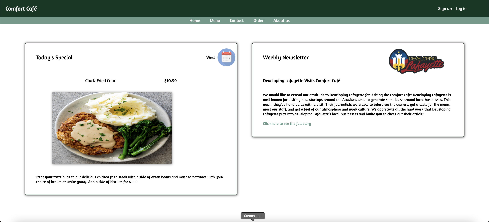

# Comfort Café

The Comfort Café is an app designed around the idea of a restaurant. This is purely conceptual and does not exist in the real world as an actual business. While working on this project, I asked my fiancee to treat me like she was my client, making changes and developing features to meet her requests.

## Features

- Authentication and authorization
- Order placement and order history tracking
- Dynamic menu page with filters based on food categories
- Data validation to prevent users from persisting incomplete or malicious data
- Styling scales for mobile

## Original Figma Designs

[Home Page](https://www.figma.com/file/rNPn0P1IX3ILIya7gbZy9Z/Comfort-Caf%C3%A9?node-id=0%3A1)

[Menu Page](https://www.figma.com/file/rNPn0P1IX3ILIya7gbZy9Z/Comfort-Caf%C3%A9?node-id=8%3A85)

[Repo Containing Home Page done in HTML/CSS](https://github.com/ctdupuis/html-css-1.git)

## Front End

- React client generated by `npx-create-react-app`
- Redux state management
- Handwritten CSS for responsive design

## Back End
- Node, Express server and session handling
- MongoDB for data persistence, Mongoose ORM to handle queries

## Credits
- Built by [myself](https://www.linkedin.com/in/cody-dupuis/) with the help of online tutorials here and there
- Page design and menu design concepts by [Miah Harrell](https://www.linkedin.com/in/miah-harrell/)